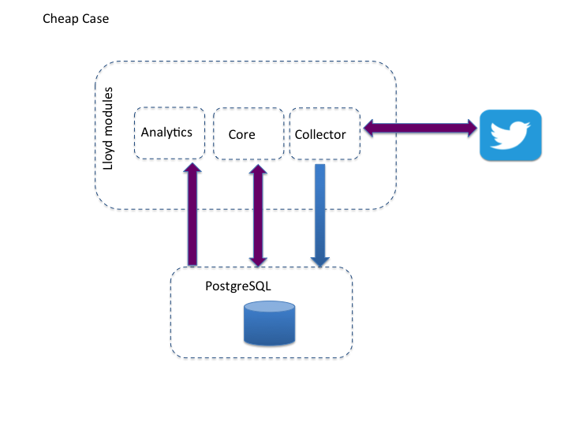

[](https://travis-ci.org/j-diaz/lloyd)

Lloyd
=====

A twitterbot that recommends interesting tweets.

**On-going progress**

Follow [Lloyd](https://twitter.com/lloydbotv1) on twitter!


##Goals
* Recommend interesting tweets.
* Learn from user feedback regarding interesting tweets and improve suggestions.
* Listen on the twitter streams for interesting tweets, and publish @mention them to the most likely follower to enjoy that tweet. 
* Provide a dashboard to showcase lloyd's statistics

##How to run?
Clone this repository and follow the below sections.

####Configuration

* OpenJDK 8 / OracleJDK 8 minimum in ```PATH``` required

Lloyd is written in Java using the [Gradle](https://gradle.org/) build tool. 
To run simply create file named ```twitter4j.properties```, at the lloyd-collector project's resource directory, with the following content:
```
debug=false
oauth.consumerKey=*********************
oauth.consumerSecret=******************************************
oauth.accessToken=**************************************************
oauth.accessTokenSecret=******************************************
```

##Architecture


##How to contribute?
Find this project interesting? 

Eager to learn the following technologies? - Maybe already know them?
 * Java 8
 * Gradle
 * Dropwizard
 * PostgreSQL || Cassandra 
 * Twitter API
 
Join the slack team ```lloydbot``` and participate in the discussion.

